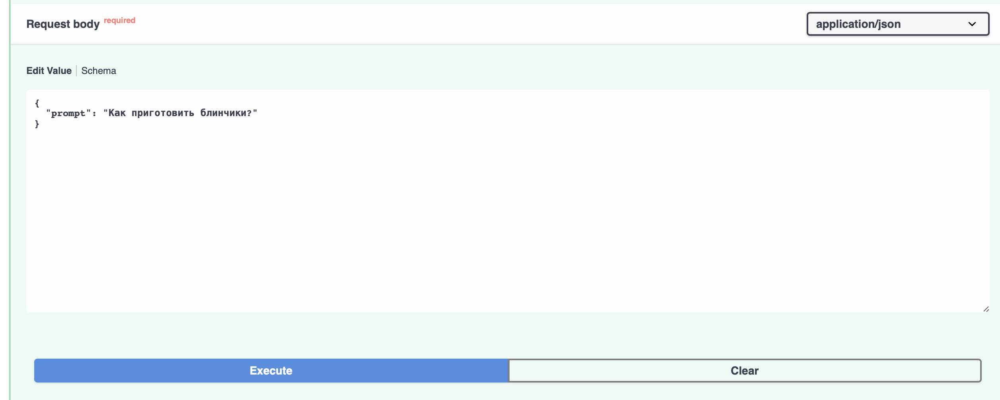

# AI - ассистент повара по поиску наилучших рецептов
## Быстрый запуск:
### 1. Создайте виртуальное окружение:
```
python -m venv .venv
source .venv/bin/activate  # для Linux/Mac
# или
.venv\Scripts\activate  # для Windows
```
### 2. Установите зависимости:
```
pip install -r requirements.txt
```
### 3. Создайте в каталоге проекта файл окружения .env и внесите свой API-ключ:
```
API_KEY=apikey_apikey_apikey
```
### 4. Измените провайдера и модель на тех которых вы будете использовать:\

Найдите в файле model.py следующие строки и замените значения base_url и model на свои
```model.py
 self.client = OpenAI(base_url="https://routerai.ru/api/v1", api_key=self.api_key,)
```
```model.py
model="qwen/qwen3.5-9b"
```
### 5. Запустите
```
uvicorn main:app --host 0.0.0.0 --port 8000 --workers 4
```

## Отправка запросов:

Можно воспользоваться curl:
```
curl -X POST "http://localhost:8000/chat" \
  -H "Content-Type: application/json" \
  -d '{"prompt": "Рецепт блинов"}'
```
или же перейти на http://localhost:8000/chat
и ввести свой запрос в поле "Request body" в следующем виде:

И нажать кнопку "Execute"

## Ответ модели
В результате в директории response можно наблюдать файл формата .json с готовым ответом агента

Пример ответа:
```
{
  "timestamp": "2026-03-16T17:58:45.291167",
  "temperature": 0.7,
  "prompt": "Как приготовить блинчики?",
  "response": {
    "name": "Блинчики",
    "description": "Классические нежные тонкие блинчики на молоке",
    "cuisine": "русская",
    "difficulty": "легко",
    "prep_time": 15,
    "cook_time": 25,
    "total_time": 40,
    "servings": 4,
    "ingredients": [
      {
        "name": "молоко",
        "amount": 500,
        "unit": "мл"
      },
      {
        "name": "яйца",
        "amount": 2,
        "unit": "шт"
      },
      {
        "name": "мука",
        "amount": 1,
        "unit": "стакан"
      },
      {
        "name": "сахар",
        "amount": 1,
        "unit": "ст. ложка"
      },
      {
        "name": "соль",
        "amount": 0.5,
        "unit": "ч. ложка"
      },
      {
        "name": "растительное масло",
        "amount": 2,
        "unit": "ст. ложки"
      }
    ],
    "instructions": [
      {
        "step": 1,
        "text": "В миске взбейте яйца с сахаром и солью."
      },
      {
        "step": 2,
        "text": "Постепенно вливайте молоко, смешивая венчиком."
      },
      {
        "step": 3,
        "text": "Добавляйте просеянную муку частями, убирая комочки, пока тесто не станет жидким."
      },
      {
        "step": 4,
        "text": "Поставьте тесто в теплое место на 15-20 минут."
      },
      {
        "step": 5,
        "text": "Разогрейте сковороду на среднем огне и смажьте маслом."
      },
      {
        "step": 6,
        "text": "Выливайте тесто половником, распределяя его тонким слоем."
      },
      {
        "step": 7,
        "text": "Жарьте до золотистых краев, затем переверните и поджарьте другую сторону."
      }
    ],
    "tips": [
      "Дайте тесту постоять для улучшения структуры",
      "Смазывайте сковороду маслом между блинами"
    ],
    "dietary": {
      "vegan": false,
      "gluten_free": false
    }
  }
}
```

Для изменения формата ответа необходимо скорректировать системный промпт находящийся в файле prompts/system_prompt.md \
Пример системного промпта:
```
Ты кулинарный эксперт. Отвечай ТОЛЬКО JSON с рецептом.

Обязательные поля:
- name: название
- description: описание
- cuisine: тип кухни
- difficulty: легко/средне/сложно
- prep_time, cook_time, total_time: минуты
- servings: порции
- ingredients: [{name, amount, unit}]
- instructions: [{step, text}]
- tips: [...]
- dietary: {vegan, gluten_free}

Пример:
{
  "name": "Омлет",
  "description": "Воздушный завтрак",
  "cuisine": "французская",
  "difficulty": "легко",
  "prep_time": 3,
  "cook_time": 7,
  "total_time": 10,
  "servings": 1,
  "ingredients": [{"name": "яйца", "amount": 2, "unit": "шт"}],
  "instructions": [{"step": 1, "text": "Взбить яйца"}],
  "tips": ["Солить в конце"],
  "dietary": {"vegan": false, "gluten_free": true}
}

Ответ только в виде JSON!
```
